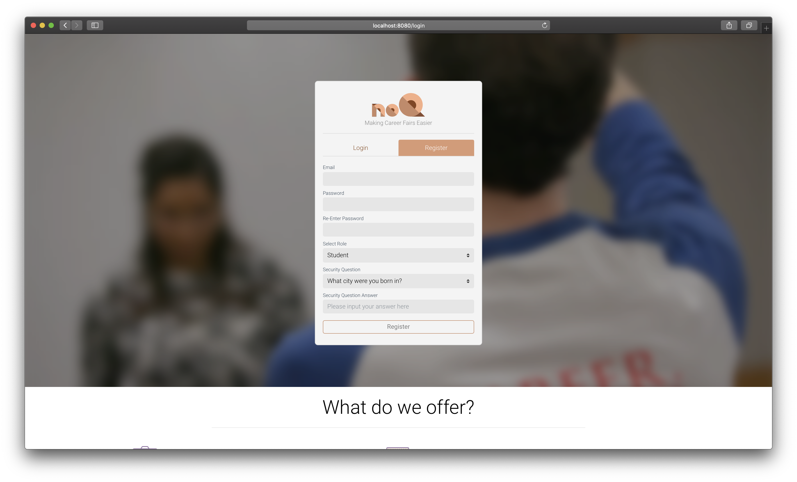

<p align="center">
  <h1 align="center">NoQ</h1>
  <p align="center">A simple job portal project</p>
</p>


<p align="center">

</p>
<p align="center">

    <a href="https://noq-client.herokuapp.com/">View Demo</a>
    ·
    <a href="https://github.com/hrishikeshpaul/noq/issues">Report Bug</a>
    ·
    <a href="https://github.com/hrishikeshpaul/noq/issues">Request Feature</a>
    <br />
    <br />
</p>

[](https://img.shields.io/badge/building-passing-brightgreen?style=flat-square&logo=appveyor)
[](https://github.com/npm/cli)
[](https://img.shields.io/badge/made%20with-vue-brightgreen)
[](https://github.com/hrishikeshpaul/portfolio-template/blob/master/LICENSE) 


<!-- TABLE OF CONTENTS -->
## Table of Contents

* [About the Project](#about-the-project)
  * [Built With](#built-with)
* [Getting Started](#getting-started)
  * [Operating System](#operating-system)
  * [Hardware](#hardware)
  * [Browser](#browser)
  * [Prerequisites](#prerequisites)
  * [Installation](#installation)
* [Documentation](#documentation)
* [The Team](#the-team)
* [Contributing](#contributing)
* [License](#license)


<!-- ABOUT THE PROJECT -->
## About The Project

No Q, is a revolutionary tool which allows for both employers and students to skip the hassle seen in modern day career fairs. For the students, we have an intuitive profile builder where you can add things like education, skills, certifications, honors, and experiences. These all culminate into a sleek home page where you will see all the positions in which your skills meet the criteria! If you are curious about the most in-demand skills, you can use our “What-if” feature where you can manually input skills to see the positions which require them. On top of that, we offer a variety of different ways to filter the posted positions; including location, skills, job title, and more. Applying is easier than ever before, as all the student needs to do is click on the position card and click on the green arrow, automatically applying them from the position and remove it from their home page. No Q is not only good for students, but employers as well! A common problem at modern career fairs is the number of unqualified candidates who waste their time when they could be chatting with someone else. With No Q, only the students who meet the positions’ criteria will be able to apply, and from there the recruiter can invite them to talk in more detail at the career fair through our intuitive messaging system. The employer also has an easy to manage list of all applicants, making it very easy to see their most important features, such as experience and the technical skills they possess.d resources that I find helpful are listed in the acknowledgements.

### Built With
* [VueJS](https://vuejs.org/)
* [Bootstrap](https://getbootstrap.com)

## Getting Started

### Operating System:
 - Windows 7+
 - Mac OSX 10.8+
- Linux 64-bit, Ubuntu 14.04+, Debian 8+, openSUSE 13.3+, Fedora Linux 24+

### Hardware:
- Processor (CPU) with 2 gigahertz (GHz) frequency or above
- A minimum of 2 GB of RAM
- Monitor Resolution 1024 X 768 or higher
- A minimum of 10 GB of available space on the hard disk
- Internet Connection Broadband (high-speed) Internet connection with a speed of 4 Mbps or higher
- Keyboard and a Mouse or some other compatible pointing device

### Browsers:
- Chrome 36+
- Edge 20+
- Mozilla Firefox 31+
- Internet Explorer 11+ (Windows only)
- Safari 6+ (MacOS only)

#### Browser Configuration:
- Your browser must be configured as follows:
- JavaScript must be enabled
- Cookies must be enabled.
- Pop-up windows must be enabled.

#### Browser Softwares:
- Adobe Shockwave for Macromedia content.
- Adobe Flash Player - Flash Player allows you to enjoy content with video, graphics and animation.


### Prerequisites
* npm
   ```sh
   $ npm install npm@latest -g
   ```

### Installation

2. Clone the repo
   ```sh
   $ git clone hhttps://github.com/hrishikeshpaul/noq.git
   ```
3. Install NPM packages
   ```sh
   $ npm install
    ```
4. For starting the development server
   ```sh
   $ cd noq
   $ npm run dev
   ```
5. If you want to run the backend for the website, you will have to follow [this guide](https://github.com/hrishikeshpaul/noq-server).


<!-- USAGE EXAMPLES -->
## Documentation

_For more information, please refer to the [Documentation](https://github.com/hrishikeshpaul/noq/blob/master/public/Software%20Users%20Manual%20Template.pdf)_


<!-- CONTACT -->
## The Team
- [Hrishikesh Paul](https://github.com/hrishikeshpaul)
- [Norton Cole](https://github.com/colen81)
- [Rui Zhang](https://github.com/ruizhang0)
- [Sharanya Ravichandran](https://github.com/sharanya17410)

<!-- CONTRIBUTING -->
## Contributing

Contributions are what make the open source community such an amazing place to be learn, inspire, and create. Any contributions you make are **greatly appreciated**.

1. Fork the Project
2. Create your Feature Branch (`git checkout -b feature/AmazingFeature`)
3. Commit your Changes (`git commit -m 'Add some AmazingFeature'`)
4. Push to the Branch (`git push origin feature/AmazingFeature`)
5. Open a Pull Request

<!-- LICENSE -->
## License

Distributed under the MIT License. See `LICENSE` for more information.


